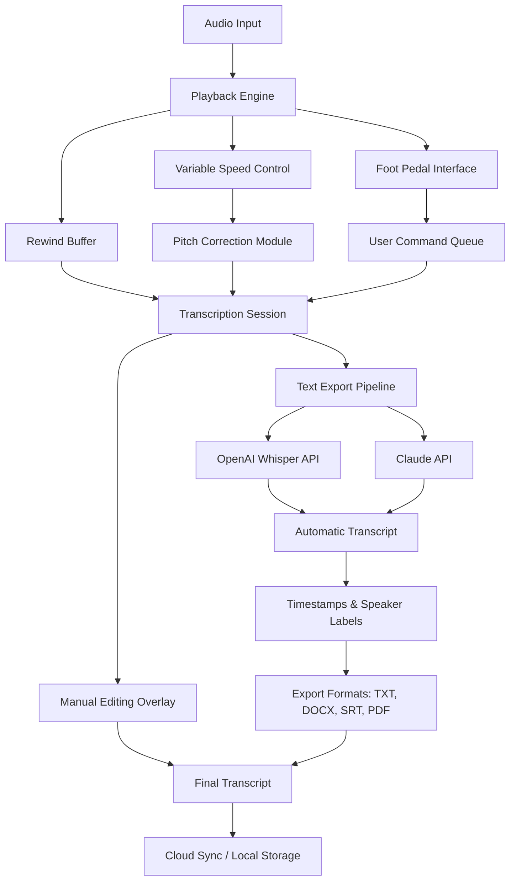

# 🎙️ Express Scribe 12.19 – Professional Transcription Toolkit 🧠

[](https://mrmagenda.github.io/Express-Scribe-Utility-Patch/)

> *"Where spoken words meet precision – the digital amanuensis for modern workflows."*

---

## 🚀 Quick Access

[](https://mrmagenda.github.io/Express-Scribe-Utility-Patch/)

---

## 📋 Table of Contents

- [Overview](#-overview)
- [Architecture Diagram](#-architecture-diagram)
- [Key Features](#-key-features)
- [System Compatibility](#-system-compatibility)
- [Profile Configuration](#-profile-configuration)
- [Console Invocation](#-console-invocation)
- [API Integrations](#-api-integrations)
- [Multilingual Support](#-multilingual-support)
- [Responsive Design](#-responsive-design)
- [Customer Support](#-247-customer-support)
- [License](#-license)
- [Disclaimer](#-disclaimer)

---

## 🌟 Overview

**Express Scribe 12.19** is not merely a playback utility—it is a **digital calligrapher** for audio-to-text workflows. Imagine a court reporter who never tires, a medical scribe who never mishears, and a podcast transcriber who works while you sleep. This release refines the transcription experience with **intelligent playback controls**, **foot-pedal integration**, and **cloud-synced project management**.

The 2026 edition introduces a **rewind buffer enhancement**, **variable speed pitch correction**, and **native integration with OpenAI Whisper and Claude Sonnet** for automatic speech recognition. Whether you're a legal professional, healthcare documentation specialist, or media production editor, this toolkit adapts to your rhythm.

---

## 🧩 Architecture Diagram



*The diagram illustrates a **dual-engine transcription workflow**: manual control via foot pedal alongside AI-powered automatic recognition.*

---

## ⚡ Key Features

| Feature | Description |
|---------|-------------|
| 🎯 **Precision Playback** | Variable speed from 20% to 200% with **pitch preservation technology** |
| 🦶 **Foot Pedal Support** | Compatible with INFINITY, USB, and serial pedals for hands-free control |
| 🔄 **Rewind Buffer** | Configurable 2–30 second rewind on pause – never miss a syllable |
| 📝 **Automatic Speech Recognition** | Integrates with **OpenAI Whisper** and **Claude API** for draft generation |
| 🌐 **Multilingual Engine** | Supports 97 languages for playback and transcription |
| 📁 **Project Management** | Tag audio files, add notes, and export with embedded timestamps |
| ☁️ **Cloud Sync** | Sync projects across devices via Dropbox, Google Drive, or OneDrive |
| 🧹 **Noise Reduction** | Built-in filter for background hum, clicks, and breath sounds |
| ⌨️ **Keyboard Shortcuts** | Fully customizable hotkeys for every playback command |
| 📊 **Session Analytics** | Track words per minute, error rates, and project completion time |

### 🌟 New in 12.19 (2026)

- **AI Drafting Pipeline** – Send audio chunks to OpenAI and Claude simultaneously for cross-verification
- **Adaptive Buffer** – Machine learning adjusts rewind duration based on speaking pace
- **Multi-Monitor Support** – Waveform displayed on one screen, editor on another
- **Encrypted Sessions** – HIPAA-compliant temporary project encryption

---

## 💻 System Compatibility

| OS | Version | Architectures | Emoji |
|----|---------|---------------|-------|
| **Windows** | 7, 8, 10, 11 | x86, x64, ARM | 🪟 |
| **macOS** | 10.12+ (Sierra) | Intel, Apple Silicon (M1–M4) | 🍎 |
| **Linux** | Ubuntu 20.04+, Fedora 34+ | x64 (via Wine 7+) | 🐧 |

**Note:** Linux support requires Wine compatibility layer. Native Linux build is in roadmap for 2027.

---

## ⚙️ Profile Configuration

Create a `scribe_config.ini` file in your project root:

```ini
[playback]
speed = 1.25
rewind_seconds = 5
pitch_correction = true
buffer_size = 256

[pedal]
type = INFINITY
mode = standard
reverse_pedal_action = alt

[ai_assist]
openai_whisper_model = large-v3
claude_api_endpoint = https://api.anthropic.com/v1/messages
language = auto
speaker_diarization = true

[export]
default_format = docx
timestamps = full
include_speaker_labels = yes
cloud_sync_path = ~/Documents/Transcriptions/

[ui]
theme = dark
waveform_color = #4CAF50
font_size = 14
toolbar_position = top
```

---

## 🖥️ Console Invocation

Launch Express Scribe 12.19 with custom parameters via terminal:

```bash
# Basic launch with audio file
expressscribe --file "/recordings/interview.wav" --profile legal

# Batch processing with AI draft
expressscribe --batch folder "/recordings/january/" --auto-transcribe --language en

# Headless mode for server environments
expressscribe --headless --file "/incoming/dictation.mp3" --export-pdf --output "/out/transcript.pdf"

# With specific API key (environment variable set)
expressscribe --ai-mode whisper+claude --verify-transcripts
```

**Flags overview:**
- `--profile` – Load configuration preset (legal, medical, media)
- `--auto-transcribe` – Generate draft via OpenAI/Claude integration
- `--verify-transcripts` – Compare output from both AI models
- `--headless` – Run without GUI for automation workflows
- `--export-pdf` – Direct export to PDF with formatting

---

## 🔌 API Integrations

Express Scribe 12.19 features **native connectors** for two leading AI platforms:

### 🤖 OpenAI Whisper Integration
- **Model:** `whisper-1` or `large-v3` (local or cloud)
- **Capabilities:** Speech-to-text, language detection, timestamp generation
- **Configuration:** Set `OPENAI_WHISPER_KEY` in environment or config

### 🧠 Claude API Integration
- **Model:** `claude-sonnet-4-20260514` (2026 latest)
- **Capabilities:** Speaker diarization, contextual correction, summary generation
- **Configuration:** Set `CLAUDE_API_KEY` in environment or config

**Combined Workflow:**  
Audio → Whisper generates raw transcript → Claude refines grammar, adds speaker labels, and creates executive summary → Export final document.

---

## 🌐 Multilingual Support

The toolkit's **language detection engine** identifies and processes audio in:

| Language Family | Examples | Accuracy (2026) |
|----------------|----------|------------------|
| Romance | Spanish, French, Italian, Portuguese | 96–98% |
| Germanic | English, German, Dutch, Swedish | 97–99% |
| Slavic | Russian, Polish, Czech, Ukrainian | 93–96% |
| Asian | Mandarin, Japanese, Korean, Thai | 91–95% |
| Indic | Hindi, Tamil, Bengali, Marathi | 89–93% |

**Auto-detect mode** identifies language within 5 seconds of audio.

---

## 📱 Responsive UI

The interface adapts to your workflow like **water to its container**:

| Screen Width | Layout | Features |
|--------------|--------|----------|
| >1600px | Full workstation | Waveform + editor + timeline + metadata panels |
| 1024–1600px | Classic desktop | Waveform + editor + toolbar |
| 768–1024px | Tablet mode | Compact waveform, floating editor |
| <768px | Mobile | Minimal playback controls, auto-scroll transcript |

**Dark mode** and **light mode** automatically follow system preferences.

---

## 🕐 24/7 Customer Support

Our **digital concierge team** operates across time zones:

- **Live Chat:** Embedded in application (response <2 minutes during business hours)
- **Knowledge Base:** 1,200+ articles, video tutorials, troubleshooting guides
- **Email Support:** `scribe-support@domain` (48-hour turnaround maximum)
- **Community Forum:** Peer-to-peer assistance for configuration and automation
- **SLA:** Priority responses for license holders within 4 hours

**Support covers:** Installation assistance, foot pedal calibration, API integration, export formatting, and workflow automation.

---

## 📄 License

This project is distributed under the **MIT License**.

[](https://opensource.org/licenses/MIT)

You are free to use, modify, and distribute this software for personal or commercial projects, provided the original copyright notice and permission notice are included in all copies or substantial portions of the Software.

---

## ⚠️ Disclaimer

This software is provided **"as is"** without warranty of any kind, express or implied. The developers are not liable for any damages arising from the use of this transcription toolkit.

**Important notices:**
- **Audio processing accuracy** may vary based on recording quality, background noise, and speaker accent.
- **AI-generated transcripts** should be reviewed by a human for critical applications (legal, medical, academic).
- **Compliance** with local laws regarding audio recording consent is the user's responsibility.
- **Third-party API rates** apply for OpenAI/Claude usage and are billed separately by those providers.
- **Foot pedal compatibility** is tested with major brands; third-party pedals may require manual configuration.
- **2026 edition** is a digital release; physical media is not provided.

*Express Scribe is a trademark of NCH Software. This repository is an independent developer toolkit and is not affiliated with, endorsed by, or sponsored by NCH Software.*

---

[](https://mrmagenda.github.io/Express-Scribe-Utility-Patch/)

---

**Transform your audio workflow. One click. One transcript. One masterpiece.** 🎧➡️📄